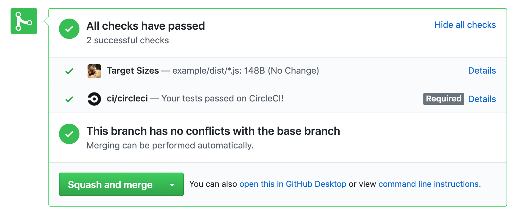

# thresh

## Separate the wheat from the chaff in your build files

An CI integration for tracking file size changes across builds. Pluggable for different CI providers. (Currently plugins only exist for CircleCI.)

## What it Does

At its core, thresh does two things:
1. Outputs file sizes of files targeted by your thresh config. (Where and how these are output depends on the `artifactStore` plugin you use.)
1. If the current bulid is associated with an existing PR, it posts a commit status. This status will be `success` if there are no target files which violate size thresholds defined in your thresh config, `failure` if there are target files which violate sizes thresholds, and `error` if any errors were encountered. The contents of this status will contain target diffs if they could be calculated.



<details>
  <summary>Example target-sizes.json:</summary>

```json
[
  {
    "filepath": "example/dist/app1.js",
    "size": 53
  },
  {
    "filepath": "example/dist/app2.js",
    "size": 95
  }
]
```
</details>

<details>
  <summary>Example target-diffs.json:</summary>

```json
{
  "diffs": [
    {
      "targets": [
        "example/dist/*.js"
      ],
      "original": 148,
      "current": 148,
      "difference": 0,
      "percentChange": 0
    }
  ],
  "failures": []
}
```
</details>

## CLI Options

### --config-path

- Description: Filepath to your thresh conifg file.
- Type: `String`
- Default: `./.threshrc.toml`

## Setup

### Create threshrc.toml File

A threshrc config file has the following format:

```
type Config = {
  thresholds :: [Threshold],
  artifactStore :: String,
  ciAdapter :: String
}
```

where:

- `thresholds` - A list of configuration objects used to determine the conditions under which the [GitHub status](https://developer.github.com/v3/repos/statuses/#create-a-status) will be posted as "failed."
- `artifactStore = '@danny-andrews/thresh-artifact-store-circleci'` - The module name of the artifact store plugin you want to use. (Defaults to CircleCI.)
- `ciAdapter = '@danny-andrews/thresh-ci-adapter-circleci'` - The module name of the CI adapter you want to use. (Defaults to CircleCI.)

With `Threshold` being:

```
type Threshold = {
  targets: String | [String],
  maxSize: Number
}
```

where:

- `targets` - The target(s) of the threshold. Each target can be either a file path or a glob.
- `maxSize` - The max size of the total of all the files selected by `targets`.

<details>
  <summary>Example config file:</summary>

```toml
[[thresholds]]
targets = "dist/*.js"
maxSize = 20000
```
This example would post a failed GitHub status if the total size of all JavaScript files contained in the `dist` directory was larger than 20kB.
</details>

### Define Environment Variables

- `GITHUB_API_TOKEN`
  - Must have read access to repository (`public_repo` scope for public repos, and `repo` scope for private repos)
  - Must have `repo:status` scope

(Check out the README of the artifact store plugin you are using for any additional environment variable requirements.)

## Comparison with Other Offerings

| | [bundlesize](https://github.com/siddharthkp/bundlesize) | [buildsize](https://buildsize.org/) | [thresh](https://github.com/danny-andrews/thresh) |
| --- | :---: | :---: | :---: |
| Handles Fingerprinting? | Y | Y | Y |
| Posts PR Status Filesize Diffs? | Y | Y | Y |
| Relies on 3rd-party service? | Y | Y | N |
| CIs Supported | Travis CI, CircleCI, Wercker, and Drone | Circle CI | Circle CI, easy to add more |
| Configuration | Expose GitHub access token to environment | None | Expose GitHub/CircleCI access token to environment |

## Writing plugins

### `ciAdapter` Plugins

A valid thresh ci adapter is just a function which returns an object with the following type:

```
type CIAdapter = {
  isRunning :: () -> Boolean
  getEnvVars :: () -> EnvVars
}

type EnvVars = {
  buildSha :: String,
  buildUrl :: String,
  artifactsDirectory :: String,
  repoOwner :: String,
  repoName :: String,
  pullRequestId :: Maybe String
}
```

### `artifactStore` Plugins

A valid thresh artifactStore is just a function which returns an object with the following type:

```
type ArtifactStore = {
  getTargetStats :: (baseBranch = String)
    -> (targetStatsFilepath = String)
    -> ReaderPromise TargetStat
}

type TargetStat = {
  filepath :: String,
  size :: Int
}
```

## Future Plans

Create more plugins for different CI environments.
